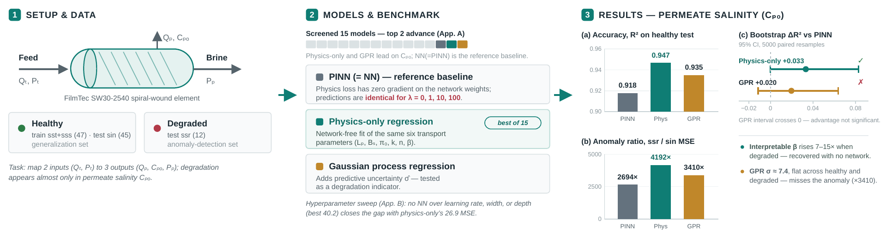

# Benchmarking a Physics-Informed Neural Network for RO Membrane Degradation Diagnosis

Code, data, and manuscript for:

> **Benchmarking a Physics-Informed Neural Network Against a Physics-Only Regression and
> Gaussian Process Regression for Reverse Osmosis Membrane Degradation Diagnosis**
> Soham Sahu, Aakarsh Agrawal, Dr. Rajesh Mahadeva — Manipal Institute of Technology
> Guided by Dr. Rajesh Mahadeva and Dr. Varadharajan



## Summary

We benchmark the physics-informed neural network (PINN) of Li & Li (2025) for reverse
osmosis (RO) membrane modeling and degradation diagnosis against 13 machine-learning
models and a network-free regression of the same six transport parameters
("physics-only"), using the same public dataset and protocol.

- Under the literal reading of the base paper's physics loss (Eq. 7), the physics term has
  **zero gradient with respect to the network weights**, so the PINN and the plain network
  are numerically identical for λ ∈ {0, 1, 10, 100}.
- **Physics-only is the best of 15 models** on permeate salinity (R² = 0.947 vs 0.918),
  with a bootstrap-supported advantage (ΔR² = +0.033, 95% CI [0.000, 0.082]) and a
  1.56× stronger anomaly signal.
- Physics-only reproduces the base paper's **defect-fraction (β) rise** on degraded data
  (7–15×) with no network.
- Gaussian process regression matches on point accuracy, but its advantage does not survive
  bootstrap testing, and its **predictive uncertainty does not detect the degradation**.

Full paper: [`manuscript/research_manuscript.pdf`](manuscript/research_manuscript.pdf) ·
Highlights: [`manuscript/highlights.txt`](manuscript/highlights.txt) ·
Graphical abstract: [`manuscript/graphical_abstract.pdf`](manuscript/graphical_abstract.pdf)

## Repository layout

| Path | Contents |
|---|---|
| `reproduce_ro_pinn.py` | Reimplementation of the base paper: data loader, solution-diffusion-with-defects physics model, NN/PINN training, hyperparameter sweep. Imported by the other scripts. |
| `compare_models.py` | 15-model screening on accuracy and anomaly detection. |
| `compare_best_two.py` | NN(=PINN) vs physics-only vs GPR: MSE/R² tables, anomaly ratios, GPR uncertainty, per-dataset β, parity plot, paired bootstrap. |
| `data/` | The four dataset workbooks (see Data below). |
| `manuscript/` | Paper PDF, graphical abstract, highlights. |
| `figures/` | Figures as they appear in the paper. |
| `supplementary/baseline_models.py` | Earlier exploratory script; not used for any result in the paper. |

## Quick start

Requires Python 3.10+.

```bash
git clone https://github.com/sohamsahu85/ro-pinn-benchmark.git
cd ro-pinn-benchmark
pip install -r requirements.txt
python reproduce_ro_pinn.py selftest      # no data needed; ends with RESULT: PASS
```

## Reproducing the paper

| Result in the paper | Command | Runtime (CPU) |
|---|---|---|
| Fig. 3 screening heat map, Appendix A | `python compare_models.py --data data` | ~5–10 min |
| Tables I–V, Figs. 4–7, GPR uncertainty, bootstrap CIs | `python compare_best_two.py --data data` | ~15–30 min |
| Appendix B hyperparameter sweep (λ bit-identical) | `python reproduce_ro_pinn.py sweep --data data --physics-target data` | ~30–60 min |
| §II-B loss-formulation comparison | `python reproduce_ro_pinn.py main --data data --physics-target nn` (and `--physics-target data`) | ~10 min each |

`--physics-target data` is the literal reading of the base paper's Eq. (7), adopted
throughout the manuscript. Outputs are written to `results*/` folders (git-ignored).
Deterministic models (physics-only, GPR, linear, ridge, polynomial, SVR, k-NN, XGBoost)
reproduce the paper's values exactly; seed-dependent models agree within the reported
standard deviations.

## Data

The `data/` folder contains, unmodified, the public dataset:

> Frost, C.; Das, T. K. (2023). *Performance Data of a SWRO arising from Wave Powered
> Desalinisation*. Mendeley Data, V1. doi:[10.17632/hws49dsfvc.1](https://doi.org/10.17632/hws49dsfvc.1)
> — licensed **CC BY 4.0**.

Experimental source: Das, Folley, Lamont-Kane & Frost, *Desalination* 571 (2024) 117069.

## Base paper

M. Li & J. Li, "Physics-informed neural networks for modeling and diagnosing degradation in
reverse osmosis membranes," *Desalination and Water Treatment* 324 (2025) 101491.
doi:[10.1016/j.dwt.2025.101491](https://doi.org/10.1016/j.dwt.2025.101491) (open access)

## Contact

Soham Sahu — soham11.mitmpl@learner.manipal.edu
